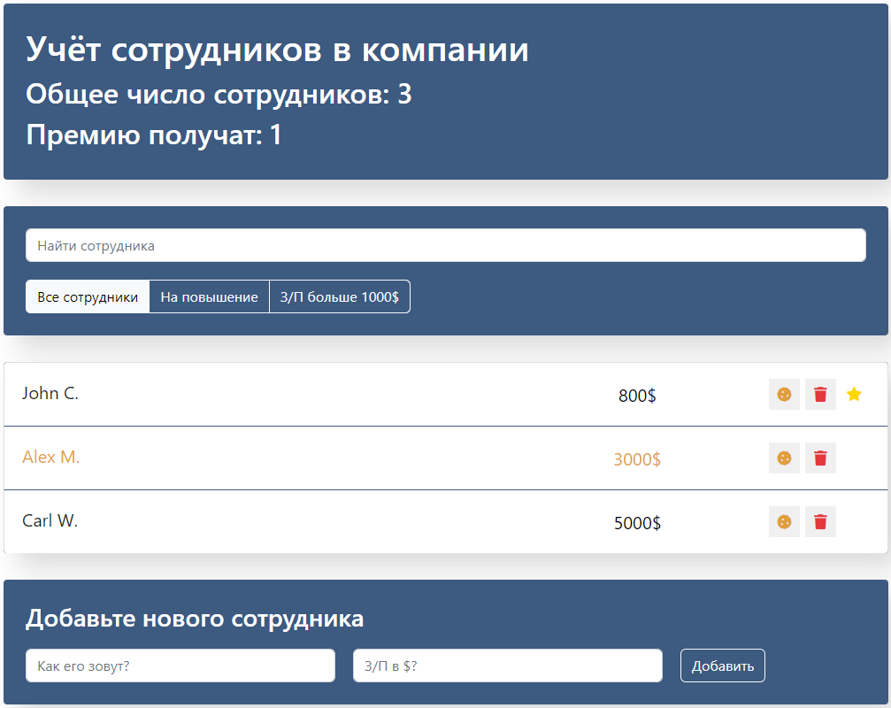

# Приложение по учету сотрудников
___

  

## Описание проекта
___

Возможности приложения:
1. производить поиск по имени или заданному фильтру
2. помечать сотрудников на повышение (клик на имя сотрудника)
3. можно редактировать зарплату (клик на поле с зарплатой)
4. премирование сотрудников (клик на иконку с печенькой)
5. удаление сотрудников из списка (клик на иконку с карзиной)
6. добавлять новых сотрудников

## Использованные технологии
___

- HTML
- CSS
- React js
- Bootstrap
- Font Awesome
- Webpack

## Обо мне
___

__Привет меня зовут Андрей. Я начинающий Frontend developer из Беларуси. Занимаюсь разработкай сайтов и веб-приложений, их адаптацией. В мои профессиональные компетенции входят знание по:__

 - HTML
 - CSS
 - JavaScript
 - React js
 - jQuery
 - ООП
 - JSON
 - AJAX
 - ES6
 - Git
 - Webpack
 - Gulp
 - Bootstrap
 - БЭМ
 - SASS/SCSS
 - Less
 - Canvas
 - Figma
 - Adobe PhotoShop
 - VS Code

 __Мои контакты:__ [e-mail](Andreykovaleu@gmail.com), [Linkedin](https://www.linkedin.com/in/andrey-kovaleu). Давайте работать вместе:)